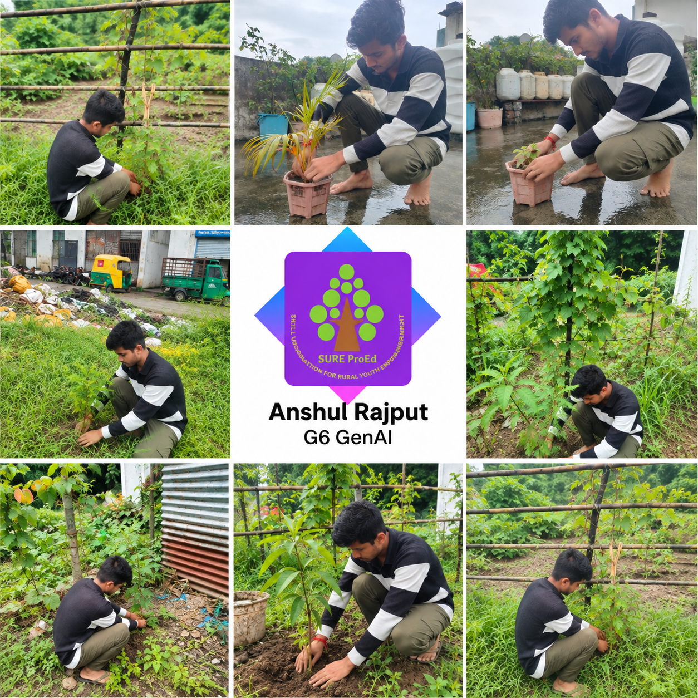
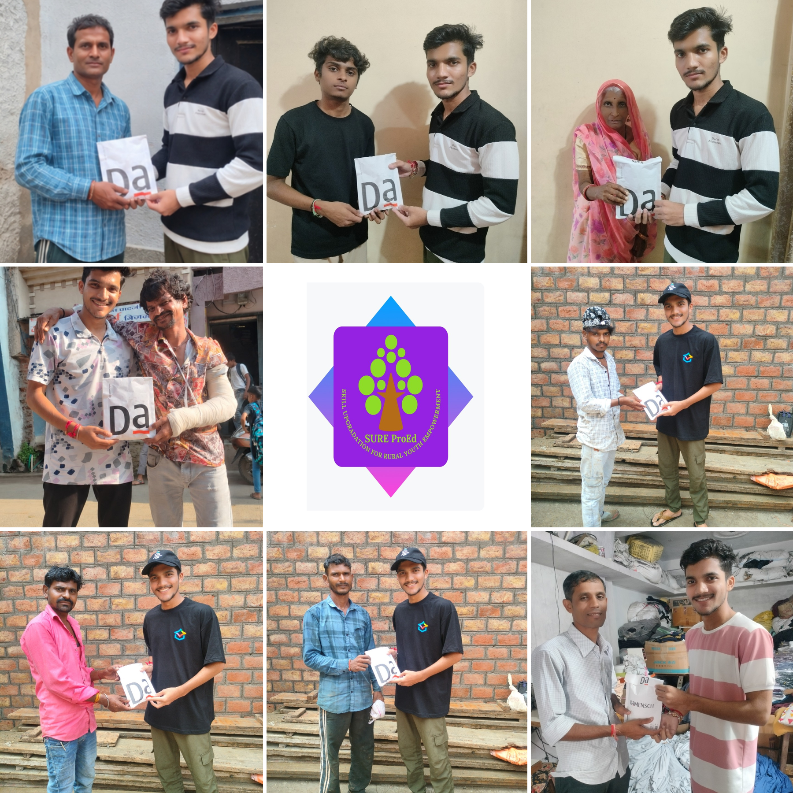

    

  <h1 align="center" style="font-family: Arial; font-weight: 600; margin-top: 15px;">SURE ProEd (formerly SURE Trust) 
      </h1>
<h2 style="color: #2b6cb0; font-family: Arial;">Skill Upgradation for Rural youth Empowerment Trust</h2>

<h2 style = "color:#333;"> Student Details </h2>

    
<strong>Name:</strong> Anshul Rajput 

    
<strong>Email ID:</strong> anshulrajputg6genai@gmail.com 

    
<strong>College Name:</strong> Chameli Devi Group of Instituion 

    
<strong>Branch/Specialization :</strong> Computer Science and Engineering 

    
<strong>College ID:</strong> 0832 

<h2 style="color:#333;"> Course Details </h2>

    
<strong>Course Opted:</strong> Generative AI 

    
<strong>Instructor Name:</strong> Prof. Radhakumari Challa 

    
<strong>Duration:</strong> 6 Month 

<h2 style="color:#333;"> Trainer Details </h2>

<strong>Trainer Name:</strong> Sreekanth Subramanian 

<strong>Trainer Email ID:</strong> sreesubu77@gmail.com 

<strong>Trainer Designation:</strong> AI Engineer 

## **Table of Contents**
- [Course Learning](#course-learning-to-be-edited-by-student)
- [Projects Completed](#projects-completed)
- [Project Introduction](#project-introduction)
- [Technologies Used](#technologies-used)
- [Roles and Responsibilities](#roles-and-responsibilities)
- [Project Report](#project-report)
- [Learnings from LST & SST](#learnings-from-lst--sst)
- [Community Services](#community-services)
- [Certificate](#certificate)
- [Acknowledgments](#acknowledgments)

## Overall Learning 

During the SURE ProEd Generative AI training, I developed a practical understanding of Generative AI concepts and their application in real-world projects. I gained hands-on experience with AI models, prompt-based applications, LangChain, Google Colab, API integration,RAG , documentation, LLM, and project presentation.

<h2 style="color:#333;"> Projects Completed </h2>

<strong><a href="#project1">Project :</a></strong> &lt; AI HealthVault &gt;

AI HealthVault is an AI-powered medical report analysis platform. It extracts information from uploaded PDF reports, generates AI-based summaries and findings, answers questions about reports, and compares detected lab values over time.

<!-- Project 1 -->
<h3 id="project1">Project : AI HealthVault </h3>

  This project involved designing and developing a basic functional module using the core concepts taught in the course.
  It focused on understanding requirements, creating structured code, and implementing key features.

  <a href="https://github.com/sure-trust/ANSHUL-RAJPUT-g6-gen-ai/tree/main/Final%20capstone%20project" target="_blank"><strong>→ View Full Project Report</strong></a>

  The final project showcased the practical application of all concepts learned throughout the course.  
  It required planning, building, optimizing, and documenting a complete real-world project.

## **References**

- [Wikipedia](https://ai-healthvault-2aqxa4mwhvxgo2auwaet36.streamlit.app/)
<!--you can add refrences over here in same syntax as above -->
---

## **Learnings from LST and SST**

LST and SST sessions helped me improve both technical and professional
skills. I learned how to approach problems systematically, communicate
ideas clearly, work with others, take responsibility for assigned tasks,
and apply learning to practical situations. These sessions also improved
my confidence in presenting and explaining my work.

---

## **Community Services**

As part of the SURE ProEd internship requirements, I participated in
community-oriented activities including tree plantation and helping senior citizens.

### **Activities Involved**  
 <!-- add the location where you have panted -->
- **Tree Plantation Drive** – Participated by planting trees and contributing to environmental improvement.

  <!-- add the location where you helped -->
- **Helping Elder Citizens** – Assisted two elderly individuals with simple daily tasks and provided support where needed. 

<!-- you can write impacts according to your experience in your words-->

### **Impact / Contribution**

- Helped create a supportive environment during the blood donation camp. <!-- add the location where you given -->
- Actively participated in promoting a greener and cleaner surroundings.
- Offered personal assistance to elder citizens, strengthening community bonds.
- Improved skills in communication, coordination, and social responsibility.

### **Photos**

<!-- add your photos below -->
<!-- change url below with your image urls (inside  src='')-->

- These are just placeholder (sample) images <!-- remove this line -->

---

## **Certificate**

The internship certificate serves as an official acknowledgment of the successful completion of my training period. It will be issued by the organization upon fulfilling all required tasks and meeting the performance expectations of the program. The certificate validates the skills, experience, and contributions made during the internship.

<!-- add your certificate image url below (inside src='')-->

---

## **Acknowledgments**

<!-- you can add Acknowledgments over here in same syntax as below . eg trainer name , company name , role etc -->

- [Prof. Radhakumari Challa](https://www.linkedin.com/in/prof-radhakumari-challa-a3850219b) , Executive Director and Founder - [SURE Trust](https://www.suretrustforruralyouth.com/)

