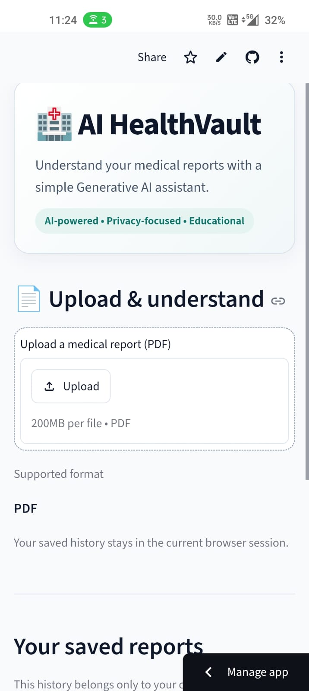
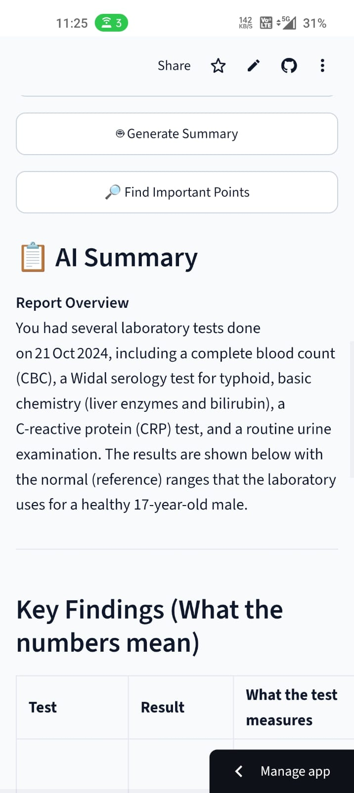
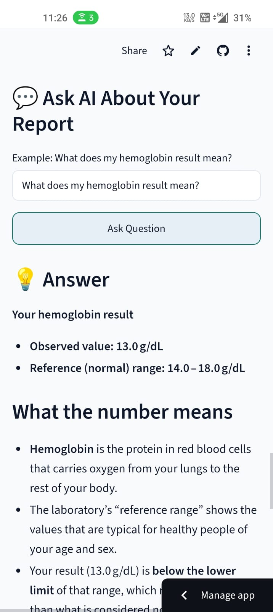
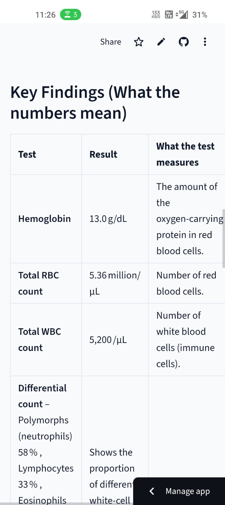
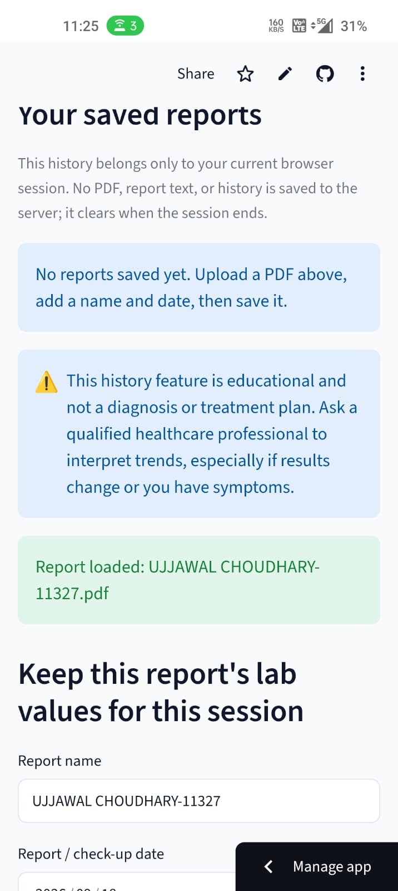

# 🏥 AI HealthVault

**AI-powered medical report analysis and explanation platform**

AI HealthVault is a Generative AI application that helps users understand text-based medical reports in simple language. Users can upload a PDF medical report, generate an AI-powered summary, identify important findings, ask questions about the report, and compare detected laboratory values across multiple reports within the current session.

> ⚠️ **Disclaimer:** AI HealthVault is an educational project. It does not provide medical diagnosis or treatment advice. Medical results should always be interpreted by a qualified healthcare professional.

---

## ✨ Features

- 📄 **PDF Medical Report Upload**
  - Upload text-based medical reports in PDF format.
  - Extract readable report content using PyPDF.

- 🤖 **AI-Powered Summary**
  - Generates a simplified summary of the uploaded report.
  - Highlights important information without intentionally inventing values.

- 🔎 **Important Findings**
  - Presents key points from the report in easy-to-understand language.

- 💬 **Ask Questions About Your Report**
  - Ask questions using natural language.
  - Answers are generated using the uploaded report as context.

- 🧪 **Laboratory Value Extraction**
  - Detects likely numerical laboratory measurements.
  - Displays test names, values, and units.

- 📊 **Report Comparison**
  - Save multiple reports during the current session.
  - Compare detected laboratory values across reports.
  - Shows numerical changes between results.

- 🔐 **Session-Based Privacy**
  - Report history is kept in the current Streamlit session.
  - No database is used for report history.

- 🖥️ **Interactive Web Interface**
  - Built with Streamlit.

---

## 🧠 How It Works

```
                 ┌─────────────────────┐
                 │   Upload PDF Report │
                 └──────────┬──────────┘
                            │
                            ▼
                 ┌─────────────────────┐
                 │   PDF Text Extract  │
                 │       PyPDF         │
                 └──────────┬──────────┘
                            │
                 ┌──────────┴──────────┐
                 ▼                     ▼
       ┌──────────────────┐   ┌──────────────────┐
       │  Report Content  │   │  Lab Value       │
       │                  │   │  Extraction      │
       └────────┬─────────┘   └────────┬─────────┘
                │                      │
                ▼                      ▼
       ┌──────────────────┐   ┌──────────────────┐
       │   Groq LLM       │   │ Session History  │
       │   AI Analysis    │   │ & Comparison     │
       └────────┬─────────┘   └────────┬─────────┘
                │                      │
                ▼                      ▼
       ┌──────────────────┐   ┌──────────────────┐
       │ Summary / Q&A /  │   │ Trend & Numeric  │
       │ Important Points │   │ Comparison       │
       └──────────────────┘   └──────────────────┘
```

---

## 🏗️ Project Architecture

```
AI-HealthVault/
│
├── frontend/
│   └── app.py
│
├── backend/
│   ├── ai_service.py
│   └── report_store.py
│
├── .streamlit/
│   └── config.toml
│
├── requirements.txt
├── .gitignore
└── README.md
```

### Main Components

**Frontend — `frontend/app.py`**

Handles the Streamlit interface, PDF upload, text extraction, AI interactions, session history, and laboratory comparison.

**AI Service — `backend/ai_service.py`**

Handles communication with the Groq-hosted LLM and applies instructions to keep responses focused on explaining the supplied report rather than diagnosing or prescribing treatment.

**Report Store — `backend/report_store.py`**

Handles laboratory value extraction, test-name normalization, session report records, and numerical comparison.

---

## 🛠️ Tech Stack

| Technology | Purpose |
|---|---|
| **Python** | Core application logic |
| **Streamlit** | Web interface |
| **Groq** | LLM API |
| **OpenAI GPT-OSS 120B via Groq** | Generative AI |
| **PyPDF** | PDF text extraction |
| **Python Regex** | Laboratory value extraction |
| **python-dotenv** | Environment configuration |

---

## 🤖 Generative AI

AI HealthVault uses a Groq-hosted large language model for report summaries, important findings, and question answering.

The application uses prompts designed to:

- Explain medical information in simple language.
- Use the supplied report as the source of information.
- Avoid intentionally inventing values.
- Avoid medical diagnosis.
- Avoid prescribing medication.
- State when required information is not available.

### AI Use Cases

**Report Summary**
- Report overview
- Key findings
- Values outside reference range when explicitly shown
- Questions to discuss with a healthcare professional

**Important Findings**
- Identifies important information from the report.

**Question Answering**
- Uses the uploaded report text as context to answer user questions.

---

## 🧪 Laboratory Value Extraction

AI HealthVault includes a lightweight rule-based extraction system.

The application:

1. Extracts text from the PDF.
2. Processes the report line by line.
3. Uses regular expressions to identify likely test names, numerical values, and units.
4. Normalizes detected test names.
5. Stores detected values in the current session.
6. Allows matching tests to be compared across reports.

This is a prototype approach. Real-world medical documents can have many different layouts and formats, so a production system would require more robust document parsing and validation.

---

## 📊 Report Comparison

Users can save multiple reports during their current session.

For a test detected in multiple reports, the application shows:

```
Earlier Result
      ↓
Latest Result
      ↓
Numerical Difference
```

The application presents the numerical difference rather than making a medical conclusion.

Different laboratories may use different reference ranges, units, and measurement methods, so numerical comparison should not be treated as medical interpretation.

---

## 🔐 Privacy & Data Handling

AI HealthVault is designed as a session-based prototype.

- Uploaded report content is processed during the current session.
- Report history is maintained in Streamlit session state.
- No database is used for report history.
- API credentials should be stored in environment variables.
- Sensitive medical documents should only be used with trusted deployments.

A production system would require stronger security controls such as authentication, access control, encryption, audit logging, and appropriate privacy/compliance measures.

---

## 🚀 Getting Started

### 1. Clone the repository

```bash
git clone https://github.com/anshull-rajput/AI-HealthVault.git
cd AI-HealthVault
```

### 2. Create a virtual environment

```bash
python -m venv venv
```

**Windows**
```bash
venv\Scripts\activate
```

**macOS / Linux**
```bash
source venv/bin/activate
```

### 3. Install dependencies

```bash
pip install -r requirements.txt
```

### 4. Configure the API key

Create a `.env` file in the project root:

```env
GROQ_API_KEY=<YOUR_GROQ_API_KEY>
GROQ_MODEL=openai/gpt-oss-120b
```

**Never commit your API key to GitHub.**

### 5. Run the application

```bash
streamlit run frontend/app.py
```

---

## 📸 Application Preview

Here are screenshots of the main AI HealthVault features:

### 🖥️ Dashboard & PDF Upload



### 🤖 AI Summary



### 🔎 Important Findings



### 💬 Ask AI About Your Report



### 📊 Report History & Session Data



> **Note:** Screenshots are provided for demonstrating the application's interface and features.

---

## 🎯 Project Objectives

- Make medical reports easier to understand.
- Demonstrate a practical Generative AI application.
- Combine PDF processing with LLM-based analysis.
- Extract structured information from unstructured report text.
- Provide simple numerical comparison between reports.
- Demonstrate responsible AI behavior by avoiding diagnosis and treatment recommendations.

---

## ⚠️ Current Limitations

- Supports text-based PDFs; scanned/image-only PDFs may not work.
- Laboratory extraction uses rule-based pattern matching.
- Medical terminology interpretation depends on the LLM.
- No authentication system is implemented.
- No persistent database is used.
- No OCR pipeline is currently included.
- The application should not be used for medical diagnosis or treatment decisions.

---

## 🔮 Future Improvements

- 🔐 User authentication and secure accounts
- 🗄️ Secure database integration
- 🖼️ OCR support for scanned reports
- 🧪 More robust medical test extraction
- 📈 Interactive laboratory trend charts
- 🔎 Retrieval-Augmented Generation (RAG)
- 🌐 Multilingual report explanations
- 🛡️ Stronger privacy and security controls
- 📊 Improved report analytics
- ☁️ Production-grade deployment architecture

---

## 💡 What I Learned

Through this project, I gained practical experience with:

- Generative AI application development
- LLM API integration
- Prompt engineering
- PDF document processing
- Text extraction
- Regular-expression-based data extraction
- Streamlit application development
- Session-state management
- Responsible AI considerations
- Project documentation and deployment

---

## 👨‍💻 Author

**Anshul Rajput**

B.Tech — Computer Science & Engineering

---

## 📄 License

This project is created for educational and demonstration purposes.
